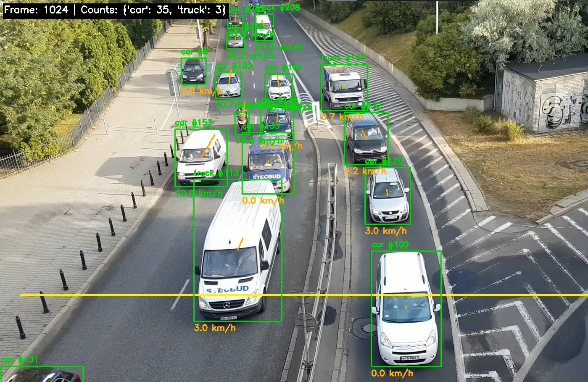
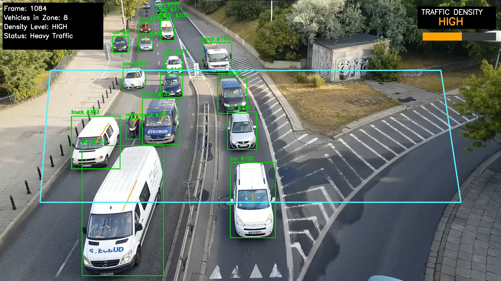
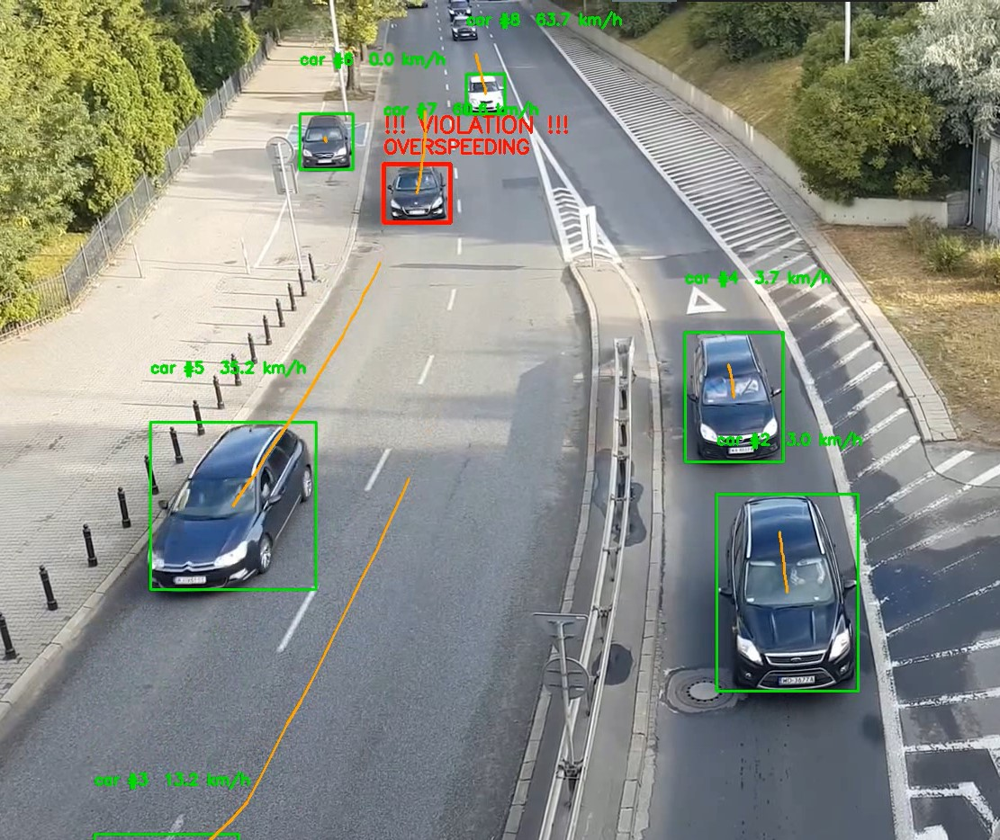

<div align="center">

# 🚦 TrafficVision AI

### Real-Time Traffic Analysis System powered by YOLOv8

[](https://python.org)
[](https://ultralytics.com)
[](https://opencv.org)
[](LICENSE)
[]()

<br/>

> **A modular, production-ready computer vision pipeline for intelligent traffic monitoring.**
> Detects, tracks, and analyzes vehicles in real time — measuring speed, estimating density,
> and flagging violations with confidence-verified logic.

<br/>

---

</div>

## 📋 Table of Contents

- [Overview](#-overview)
- [Modules](#-modules)
  - [Module 1 — Detection, Counting & Speed Estimation](#module-1--detection-counting--speed-estimation)
  - [Module 2 — Traffic Density Estimation](#module-2--traffic-density-estimation)
  - [Module 3 — Violation Detection](#module-3--violation-detection)
- [Architecture](#-architecture)
- [Project Structure](#-project-structure)
- [Installation](#-installation)
- [Usage](#-usage)
- [Configuration](#-configuration)
- [Roadmap](#-roadmap)

---

## 🔭 Overview

**TrafficVision AI** is a real-time traffic analysis system built on top of YOLOv8 and ByteTrack. It processes traffic footage from a forward-facing overhead camera and runs three independent analysis modules — all sharing a common utility layer to guarantee consistent, zero-duplication logic across every pipeline.

### ✨ Key Highlights

| Feature | Detail |
|---|---|
| 🎯 **Detection Model** | YOLOv8m — balanced accuracy and speed |
| 🔁 **Tracker** | ByteTrack — robust multi-object tracking |
| 📐 **Perspective Correction** | Adaptive PPM curve calibrated per frame row |
| 🗳️ **Class Stability** | Confidence-weighted majority voting over 15-frame window |
| 🧱 **Architecture** | Fully modular — shared `utils.py` across all scripts |
| 🚗 **Vehicle Classes** | Car · Motorcycle · Bus · Truck |

---

## 🧩 Modules

### Module 1 — Detection, Counting & Speed Estimation

> **Script:** `src/speed_estimator.py`

Detects and tracks every vehicle in the frame, estimates its real-world speed using perspective-corrected pixel-to-meter mapping, and counts vehicles as they cross a configurable line.

**How speed estimation works:**

Standard pixel displacement divided by time gives incorrect speeds because vehicles appear much larger near the camera than far away. This system applies a perspective correction curve — `pixels per meter` scales with the square of the vehicle's vertical position in the frame:

```
PPM(y) = 2.5 + 362.5 × (y / frame_height) ^ 2.4
```

This keeps speed readings consistent from the top of the frame (~55 km/h) all the way to the bottom, without drift or surge.

**Features:**
- ✅ Per-vehicle speed display in km/h
- ✅ Colour-coded label (green = moving, amber = near-stationary)
- ✅ Vehicle trail overlay (orange polyline)
- ✅ Crossing-line vehicle counter by class
- ✅ Stopped vehicle detection (`pixel_distance < 2.5`)
- ✅ Confidence-weighted class voting (no permanent misclassification)

<br/>

> 📸 *Screenshot — speed estimation output with trails, labels, and crossing line*

<!-- Replace with your actual screenshot -->
| Detection & Speed Output |
|:---:|
|  |

---

### Module 2 — Traffic Density Estimation

> **Script:** `src/density_estimator.py`

Defines a configurable polygon zone over the road and counts the number of active, confirmed vehicles inside it each frame. Classifies the current traffic state and renders a live dashboard overlay.

**Density Levels:**

| Level | Vehicle Count | Status | Colour |
|---|---|---|---|
| 🟢 LOW | ≤ 4 | Light Traffic | Green |
| 🟡 MEDIUM | 5 | Moderate Traffic | Yellow |
| 🟠 HIGH | 6 – 13 | Heavy Traffic | Orange |
| 🔴 JAM | > 13 | Congestion / Jam | Red |

**Features:**
- ✅ Configurable polygon density zone (percentage-based, resolution-independent)
- ✅ Tracks only mature detections (age ≥ 8 frames) to filter ghost boxes
- ✅ Live info panel — frame, vehicle count, density level, status
- ✅ Colour-coded status badge and animated progress bar
- ✅ Zone boundary overlay drawn on every frame

<br/>

> 📸 *Screenshot — density estimation with zone overlay and live dashboard*

<!-- Replace with your actual screenshot -->
| Density Estimation Output |
|:---:|
|  |

---

### Module 3 — Violation Detection

> **Script:** `src/violation_detector.py`

Detects two types of traffic violations — overspeeding and wrong-way driving — with a multi-layer verification system designed to eliminate false positives from tracker glitches or noisy frames.

**Violation Types:**

| Type | Trigger Condition |
|---|---|
| 🚨 **OVERSPEEDING** | Average speed exceeds `SPEED_LIMIT + SPEED_MARGIN` for 20 **continuous** frames, with low speed std deviation |
| 🔄 **WRONG WAY** | Upward movement (away from camera) sustained for 20 continuous frames, confirmed across 75% of recent history points |

**Verification Pipeline — 5 layers before a violation is confirmed:**

```
Frame N  ──► Counter +1 if condition met, hard reset to 0 if not
                │
                ▼
           Counter ≥ 20?  ──── NO ──► Skip (not sustained enough)
                │
               YES
                │
                ▼
        Speed std dev ≤ 10?  ── NO ──► Skip (erratic / glitch)
                │
               YES
                │
                ▼
      Avg speed > limit + margin?  ── NO ──► Skip (borderline)
                │
               YES
                │
                ▼
        Track age ≥ 30 frames?  ── NO ──► Skip (too new / unreliable)
                │
               YES
                │
                ▼
         ✅ CONFIRMED — log once, save crop, draw red box
```

**Features:**
- ✅ Red bounding box + `!!! VIOLATION !!!` overlay on confirmed vehicles
- ✅ Each violation logged **once** per `(track_id, violation_type)` — no duplicates
- ✅ Cropped vehicle image saved to `data/output/violations/`
- ✅ Full violation log printed at end of run (timestamp, class, speed)
- ✅ Live HUD violation counter
- ✅ Hard counter reset — continuity is strictly enforced

<br/>

> 📸 *Screenshot — violation detection with red box overlay and violation log*

<!-- Replace with your actual screenshot -->
| Violation Detection Output |
|:---:|
|  |

---

## 🏗 Architecture

All three modules share a single utility layer. No logic is duplicated across scripts.

```
┌─────────────────────────────────────────────────────────┐
│                        utils.py                         │
│                                                         │
│  parse_box()          — detection filtering             │
│  update_class()       — confidence-weighted voting      │
│  get_pixels_per_meter()— perspective PPM curve          │
│  estimate_speed()     — full speed logic (source of     │
│                          truth for all scripts)         │
│  check_line_cross()   — vehicle line counting           │
│  is_in_zone()         — polygon zone membership         │
│  get_density_level()  — density classification          │
│  draw_density_panel() — density HUD drawing             │
│  draw_box_label()     — bounding box + label            │
│  draw_trail()         — polyline trail overlay          │
│  draw_speed()         — speed text overlay              │
└────────────────────┬────────────────────────────────────┘
                     │ imported by
        ┌────────────┼────────────────┐
        ▼            ▼                ▼
speed_estimator  density_estimator  violation_detector
   .py               .py                .py
```

---

## 📁 Project Structure

```
TrafficVision/
│
├── src/
│   ├── utils.py                  # Shared utility functions (single source of truth)
│   ├── speed_estimator.py        # Module 1 — Detection, counting, speed
│   ├── density_estimator.py      # Module 2 — Traffic density
│   └── violation_detector.py     # Module 3 — Violation detection
│
├── data/
│   ├── input/
│   │   └── traffic.mp4           # Input video
│   └── output/
│       ├── speed_output.mp4
│       ├── density_output.mp4
│       ├── violation_output.mp4
│       └── violations/           # Cropped violation evidence images
│
├── docs/
│   └── images/                   # README screenshots
│
├── requirements.txt
└── README.md
```

---

## ⚙️ Installation

**1. Clone the repository**
```bash
git clone https://github.com/yourusername/TrafficVision.git
cd TrafficVision
```

**2. Create a virtual environment**
```bash
python -m venv venv
source venv/bin/activate        # Linux / macOS
venv\Scripts\activate           # Windows
```

**3. Install dependencies**
```bash
pip install -r requirements.txt
```

**4. Place your input video**
```bash
mkdir -p data/input data/output/violations
cp your_traffic_video.mp4 data/input/traffic.mp4
```

**`requirements.txt`**
```
ultralytics>=8.0.0
opencv-python>=4.8.0
numpy>=1.24.0
```

> **Note:** YOLOv8 will automatically download `yolov8m.pt` on first run.

---

## 🚀 Usage

Run each module independently from the `src/` directory:

```bash
# Module 1 — Speed Estimation & Counting
python src/speed_estimator.py

# Module 2 — Traffic Density
python src/density_estimator.py

# Module 3 — Violation Detection
python src/violation_detector.py
```

Press **`Q`** at any time to stop a running module and save the output video.

---

## 🔧 Configuration

All key parameters are at the top of each script and easy to tune:

### Speed Estimator
| Parameter | Default | Description |
|---|---|---|
| `CONFIDENCE_THRESHOLD` | `0.35` | Minimum YOLO detection confidence |
| `IMG_SIZE` | `1280` | Inference resolution |
| `LINE_Y` | `65% of height` | Counting line position |
| `MIN_BOX_WIDTH/HEIGHT` | `25px` | Minimum box size filter |

### Density Estimator
| Parameter | Default | Description |
|---|---|---|
| `DENSITY_ZONE` | Polygon (10–88% width, 25–72% height) | Road analysis zone |
| `DENSITY_THRESHOLDS` | LOW=4, MEDIUM=5, HIGH=13 | Vehicle count breakpoints |

### Violation Detector
| Parameter | Default | Description |
|---|---|---|
| `SPEED_LIMIT` | `65 km/h` | Overspeed threshold |
| `VIOLATION_FRAMES` | `20` | Continuous frames required to confirm |
| `SPEED_MARGIN` | `3.0 km/h` | Must exceed limit by this margin |
| `SPEED_STD_MAX` | `10.0 km/h` | Max speed std dev (glitch filter) |
| `MIN_TRACK_AGE` | `30 frames` | Track must be this old before violations fire |
| `WRONG_WAY_THRESHOLD` | `-4.0 px` | Minimum upward pixel movement per interval |
| `WRONG_WAY_MIN_RATIO` | `0.75` | Fraction of frames that must confirm wrong way |

### PPM Curve (in `utils.py`)
| Parameter | Default | Description |
|---|---|---|
| `BASE_PPM` | `2.5` | Pixels per meter at top of frame |
| `MAX_PPM` | `365.0` | Pixels per meter at bottom of frame |
| `EXPONENT` | `2.4` | Curve steepness |

---

## 🗺 Roadmap

This is **Phase 1** of a larger integrated system. Upcoming work:

- [ ] **Unified Dashboard** — single script running all three modules simultaneously with a split/overlay display
- [ ] **License Plate Recognition** — OCR integration for violation evidence
- [ ] **CSV / JSON Export** — structured logs for all events and counts
- [ ] **REST API** — expose live stats as an endpoint
- [ ] **Multi-Camera Support** — handle multiple feeds with independent zones
- [ ] **Web Dashboard** — live browser-based monitoring interface

---

<div align="center">

**Built with 💻 Python · YOLOv8 · OpenCV · ByteTrack**

*TrafficVision AI — Phase 1 | Active Development*

</div>
